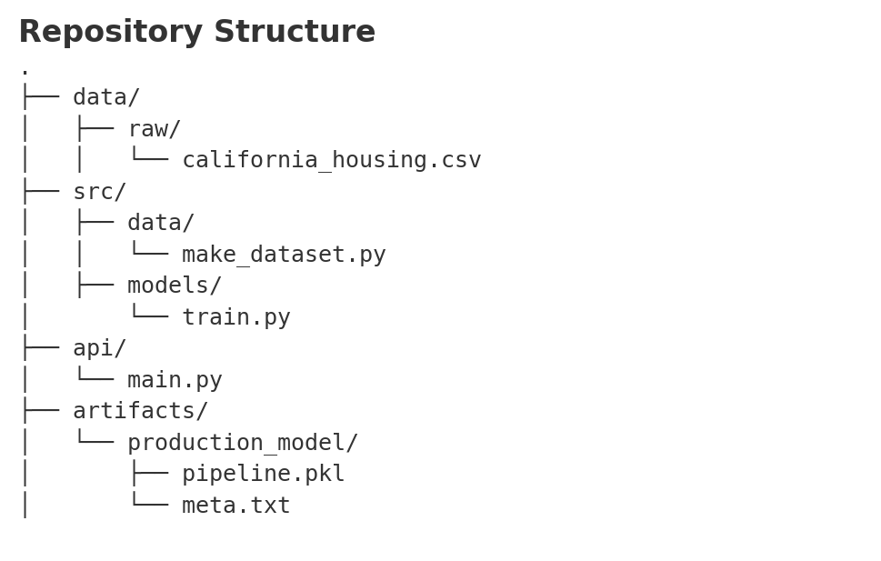
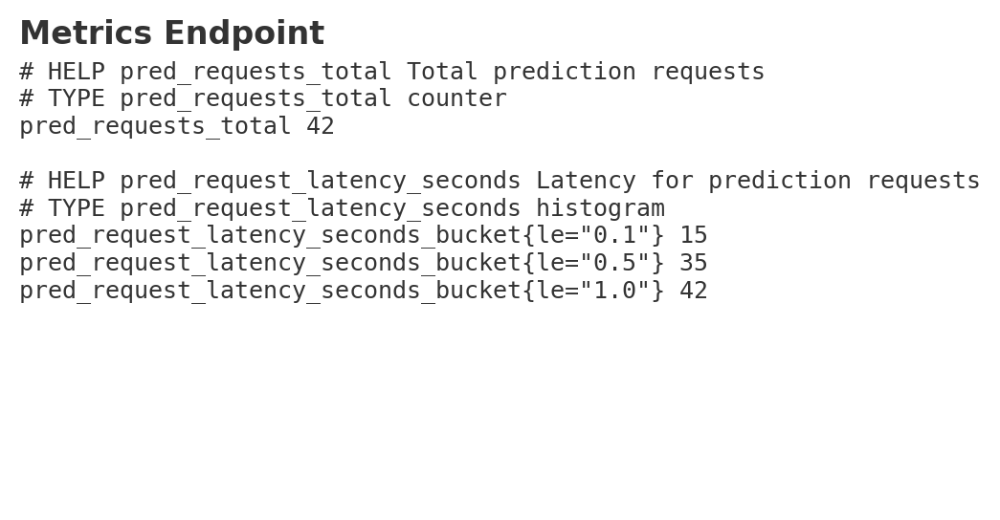

# 🏗️ California Housing — End-to-End MLOps Pipeline


A complete **MLOps project** demonstrating best practices from **data versioning** to **monitoring** using:

**Tech Stack:**  
`Git` · `DVC` · `MLflow` · `FastAPI` · `Docker` · `GitHub Actions` · `Prometheus` · `Grafana`

---

## 📌 Project Overview

- **Dataset:** California Housing dataset (`sklearn.datasets`)
- **Problem Type:** Regression — Predict median house value
- **Model Candidates:** Linear Regression, Decision Tree Regressor
- **Pipeline Coverage:**  
  ✔ Data versioning (DVC)  
  ✔ Experiment tracking (MLflow)  
  ✔ Model serving (FastAPI)  
  ✔ Containerization (Docker)  
  ✔ CI/CD (GitHub Actions)  
  ✔ Monitoring (Prometheus + Grafana)  

---

## 📂 Repository Structure
```
.
├── data/                  # DVC-tracked dataset
├── src/                   # data processing & training scripts
├── api/                   # FastAPI app & SQLite logging
├── artifacts/             # exported production model
├── monitoring/            # Prometheus scrape config
├── .github/workflows/     # CI/CD pipeline
├── docker-compose.yml     # Prometheus & Grafana stack
├── grafana_dashboard.json # Pre-built dashboard
├── SUMMARY.md              # Architecture summary
└── README.md
```

---
## 🚀 Quickstart

### 1️⃣ Clone & Install
```bash
git clone https://github.com/2023ac05422/mlops-california-housing.git
cd mlops-california-housing
python -m venv venv
source venv/bin/activate   # or .\venv\Scripts\activate on Windows
pip install -r requirements.txt
```

### 2️⃣ Get Data & Track with DVC
```bash
python -m src.data.make_dataset
dvc init
dvc add data/raw/california_housing.csv
git add .
git commit -m "Add dataset with DVC"
```

### 3️⃣ Train Models & Track with MLflow
```bash
python -m src.models.train
mlflow ui  # optional — http://127.0.0.1:5000
```

### 4️⃣ Serve Model via FastAPI
```bash
uvicorn api.main:app --reload --port 8000
```
Prediction request:
```bash
curl -X POST "http://127.0.0.1:8000/predict" -H "Content-Type: application/json" -d '{"MedInc":8.3,"HouseAge":41.0,"AveRooms":5.9,"AveBedrms":1.1,"Population":980.0,"AveOccup":2.7,"Latitude":34.2,"Longitude":-118.3}'
```

### 5️⃣ Dockerize
```bash
docker build -t kbatta/california-regressor:latest .
docker run -p 8000:8000 kbatta/california-regressor:latest
```

### 6️⃣ Monitoring
```bash
docker compose up -d
# Prometheus: http://localhost:9090
# Grafana:    http://localhost:3000 (admin/admin)
```

---

## 📊 Screenshots

| Feature | Screenshot |
|---------|------------|
| **Repo Structure** |  |
| **MLflow Runs** |  |
| **API Prediction** |  |
| **Metrics Endpoint** |  |
| **Grafana Dashboard** |  |

---

## 🛠️ CI/CD Workflow
- **Trigger:** Push to `main`
- **Steps:** Lint → Test → Build Docker → Push to Docker Hub
- **Config:** See [ci.yml](.github/workflows/ci.yml)

---

---

## 🔗 Links
- **GitHub Repo:** [https://github.com/2023ac05422/mlops-california-housing](https://github.com/2023ac05422/mlops-california-housing.git)
- **Docker Hub:** [https://hub.docker.com/repository/docker/kbatta/california-regressor](https://hub.docker.com/repository/docker/kbatta/california-regressor)
- **MLflow UI:** `http://127.0.0.1:5000`
- **Prometheus:** `http://localhost:9090`
- **Grafana:** `http://localhost:3000`
- **API Documentation:** `http://localhost:8000/docs`

---

## 👥 Contributors
Thanks to the following people who contributed to this project:

## 👥 Contributors
Thanks to the following people who contributed to this project:

| Contributor | BITS Id |
|-------------|----------------|
| **SHIVENDRA SINGH** | 2023ac05863 |
| **G ANIL KUMAR** | 2023aa05757 |
| **KARTIK BATTA | 2023ac05422 |
| **NANCY AGARWAL | 2023ac05979 |
