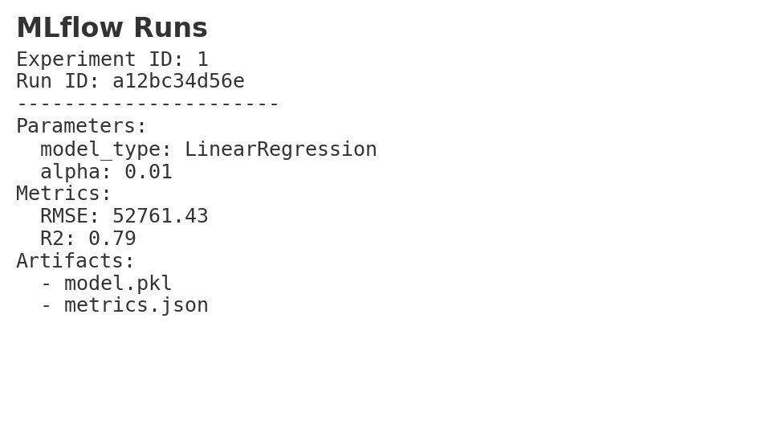
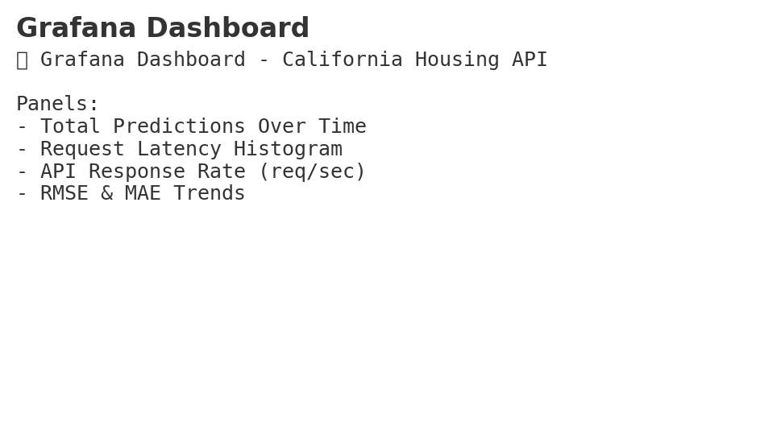

# 📄 MLOps Pipeline Summary — California Housing

## 📌 Goal
Build, track, package, deploy, and monitor a regression model using best MLOps practices.

---

## 🔧 Architecture

**Step 1: Data Versioning**
- Script: `src/data/make_dataset.py`
- Saves dataset to `data/raw/california_housing.csv`
- Tracked via **DVC**

**Step 2: Model Development & Tracking**
- Models: `Linear Regression`, `Decision Tree Regressor`
- Framework: `scikit-learn`
- Tracking: **MLflow** logs parameters, metrics, and artifacts
- Selection: Best RMSE → exported to `artifacts/production_model/pipeline.pkl`

**Step 3: Model Serving**
- Framework: **FastAPI**
- Endpoints:
  - `/health` — Status & model version
  - `/predict` — Returns prediction
  - `/metrics` — Prometheus-compatible metrics
- Input validation: **Pydantic**

**Step 4: Containerization**
- **Dockerfile** builds a minimal image with FastAPI app

**Step 5: CI/CD**
- **GitHub Actions**: Lint → Test → Build → Push to Docker Hub
- Secrets used:
  - `DOCKERHUB_USERNAME`
  - `DOCKERHUB_TOKEN`

**Step 6: Monitoring**
- **Prometheus** scrapes `/metrics`
- **Grafana dashboard** shows:
  - Total predictions
  - Requests per second
  - Latency percentiles (p50, p90, p99)

---

## 📊 Key Metrics

| Metric  | Description                       |
|---------|-----------------------------------|
| RMSE    | Root Mean Squared Error           |
| MAE     | Mean Absolute Error               |
| R²      | Coefficient of Determination      |
| Latency | API response time histogram       |

---

## 📷 Screenshots
*(Replace placeholders in `docs/` before submission)*

- 
- 
- 

---

## 🔗 Useful Links
- **GitHub Repo:** [https://github.com/2023ac05422/mlops-california-housing](https://github.com/2023ac05422/mlops-california-housing.git)
- **Docker Hub:** [https://hub.docker.com/repository/docker/kbatta/california-regressor](https://hub.docker.com/repository/docker/kbatta/california-regressor)
- **MLflow UI:** `http://127.0.0.1:5000`
- **Prometheus:** `http://localhost:9090`
- **Grafana:** `http://localhost:3000`
- **API Documentation:** `http://localhost:8000/docs`

---

## 👥 Contributors
Thanks to the following people who contributed to this project:

| Contributor | BITS Id |
|-------------|----------------|
| **SHIVENDRA SINGH** | 2023ac05863 |
| **G ANIL KUMAR** | 2023aa05757 |
| **KARTIK BATTA | 2023ac05422 |
| **NANCY AGARWAL | 2023ac05979 |
